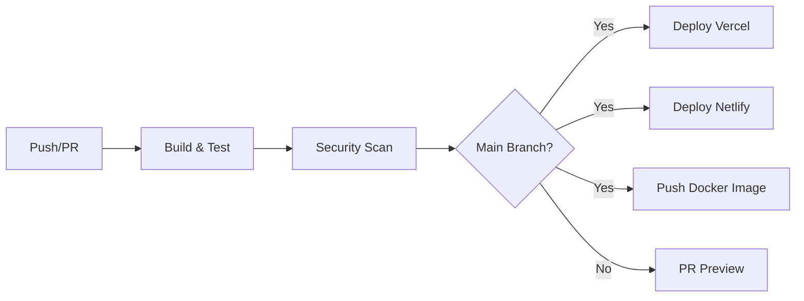

# 🚀 DevOps Guide - QwenCore

**Author**: donny-devops  
**Last Updated**: 2026-01-20

This guide covers the DevOps infrastructure, CI/CD pipelines, deployment strategies, and operational procedures for QwenCore.

---

## 📋 Table of Contents

1. [Infrastructure Overview](#infrastructure-overview)
2. [CI/CD Pipeline](#cicd-pipeline)
3. [Docker Setup](#docker-setup)
4. [Deployment Options](#deployment-options)
5. [Monitoring & Observability](#monitoring--observability)
6. [Security](#security)
7. [Disaster Recovery](#disaster-recovery)
8. [Runbooks](#runbooks)

---

## 🏗️ Infrastructure Overview

### Architecture

```
┌─────────────────────────────────────────────────────────────┐
│                    GitHub Repository                         │
│  ┌───────────────────────────────────────────────────────┐  │
│  │           GitHub Actions CI/CD Pipeline                │  │
│  │  ┌─────────┐  ┌──────────┐  ┌─────────────────────┐  │  │
│  │  │  Build  │→ │  Test    │→ │  Security Scan      │  │  │
│  │  └─────────┘  └──────────┘  └─────────────────────┘  │  │
│  │       ↓              ↓                ↓                │  │
│  │  ┌─────────────────────────────────────────────────┐  │  │
│  │  │              Deploy Targets                      │  │  │
│  │  │  ┌─────────┐  ┌──────────┐  ┌───────────────┐  │  │  │
│  │  │  │ Vercel  │  │ Netlify  │  │ Docker Hub    │  │  │  │
│  │  │  └─────────┘  └──────────┘  └───────────────┘  │  │  │
│  │  └─────────────────────────────────────────────────┘  │  │
│  └───────────────────────────────────────────────────────┘  │
└─────────────────────────────────────────────────────────────┘
```

### Technology Stack

| Layer | Technology | Purpose |
|-------|-----------|---------|
| CI/CD | GitHub Actions | Automated builds & deployments |
| Container | Docker | Application packaging |
| Registry | Docker Hub / GHCR | Image storage |
| Hosting | Vercel / Netlify | Static site hosting |
| Proxy | Nginx | Reverse proxy & caching |
| Monitoring | Built-in | Health checks & logs |

---

## 🔄 CI/CD Pipeline

### Pipeline Stages



### Workflow: `ci-cd.yml`

**Triggers:**
- Push to `main` or `develop`
- Pull requests to `main` or `develop`

**Jobs:**

1. **Build & Test**
   - Checkout code
   - Setup Node.js 20
   - Install dependencies
   - Type check
   - Build project
   - Upload artifacts

2. **Security Scan**
   - npm audit
   - TruffleHog secret scanning

3. **Deploy to Vercel** (main branch only)
   - Download build artifacts
   - Deploy to production

4. **Deploy to Netlify** (main branch only)
   - Download build artifacts
   - Deploy to production

5. **Docker Build & Push** (main branch only)
   - Build multi-stage image
   - Push to Docker Hub & GHCR

### Required Secrets

| Secret | Description | Required For |
|--------|-------------|--------------|
| `VERCEL_TOKEN` | Vercel API token | Vercel deployment |
| `VERCEL_ORG_ID` | Vercel organization ID | Vercel deployment |
| `VERCEL_PROJECT_ID` | Vercel project ID | Vercel deployment |
| `NETLIFY_AUTH_TOKEN` | Netlify auth token | Netlify deployment |
| `NETLIFY_SITE_ID` | Netlify site ID | Netlify deployment |
| `DOCKERHUB_USERNAME` | Docker Hub username | Docker push |
| `DOCKERHUB_TOKEN` | Docker Hub token | Docker push |

### Setting Up Secrets

```bash
# GitHub CLI
gh secret set VERCEL_TOKEN
gh secret set VERCEL_ORG_ID
gh secret set VERCEL_PROJECT_ID
gh secret set NETLIFY_AUTH_TOKEN
gh secret set NETLIFY_SITE_ID
gh secret set DOCKERHUB_USERNAME
gh secret set DOCKERHUB_TOKEN
```

---

## 🐳 Docker Setup

### Dockerfile Stages

1. **Builder Stage**
   - Node.js 20 Alpine
   - Installs dependencies
   - Builds the application

2. **Production Stage**
   - Nginx Alpine
   - Serves static files
   - Includes security headers
   - Health check endpoint

3. **Development Stage**
   - Node.js 20 Alpine
   - Hot module replacement
   - Volume mounts for live reload

### Building Images

```bash
# Production image
docker build -t qwencore:latest .

# Development image
docker build --target development -t qwencore:dev .

# With build args
docker build \
  --build-arg NODE_ENV=production \
  -t qwencore:latest \
  .
```

### Running Containers

```bash
# Production
docker run -d -p 8080:80 --name qwencore qwencore:latest

# Development
docker run -d -p 5173:5173 -v $(pwd):/app --name qwencore-dev qwencore:dev
```

### Docker Compose

```bash
# Start production
docker-compose up -d qwencore-prod

# Start development
docker-compose --profile dev up -d qwencore-dev

# Start with proxy
docker-compose --profile proxy up -d

# View logs
docker-compose logs -f

# Stop all
docker-compose down
```

### Image Tags

| Tag | Description |
|-----|-------------|
| `latest` | Latest production build |
| `main` | Latest main branch build |
| `develop` | Latest develop branch build |
| `v1.0.0` | Specific version |
| `sha-abc123` | Commit-specific build |

---

## 🚀 Deployment Options

### Option 1: Vercel (Recommended)

**Pros:**
- Zero-config deployment
- Automatic HTTPS
- Global CDN
- Preview deployments
- Analytics

**Setup:**
```bash
# Install Vercel CLI
npm i -g vercel

# Login
vercel login

# Deploy
vercel --prod
```

**Configuration:** `vercel.json`

### Option 2: Netlify

**Pros:**
- Easy setup
- Form handling
- Functions support
- Split testing

**Setup:**
```bash
# Install Netlify CLI
npm i -g netlify-cli

# Login
netlify login

# Deploy
netlify deploy --prod
```

**Configuration:** `netlify.toml`

### Option 3: Docker Self-Hosted

**Pros:**
- Full control
- No vendor lock-in
- Custom infrastructure
- Cost-effective at scale

**Setup:**
```bash
# Pull image
docker pull donnydevops/qwencore:latest

# Run
docker run -d \
  -p 80:80 \
  --restart unless-stopped \
  --name qwencore \
  donnydevops/qwencore:latest
```

### Option 4: GitHub Pages

**Pros:**
- Free hosting
- Integrated with repo
- Custom domains

**Setup:**
```bash
# Add to package.json scripts
"deploy": "gh-pages -d dist"

# Deploy
npm run deploy
```

---

## 📊 Monitoring & Observability

### Health Checks

**HTTP Endpoint:**
```bash
curl http://localhost:80/health
# Returns: "healthy"
```

**Docker Health Check:**
```bash
docker inspect --format='{{.State.Health.Status}}' qwencore
```

### Logging

**Application Logs:**
```bash
# Docker
docker logs qwencore

# Docker Compose
docker-compose logs -f qwencore-prod

# Nginx access logs
docker exec qwencore cat /var/log/nginx/access.log
```

### Metrics

Since QwenCore is client-side only, monitoring focuses on:

1. **Uptime**: Health check endpoint
2. **Performance**: Lighthouse scores
3. **Bundle Size**: Build artifacts
4. **Error Rates**: Browser console (client-side)

### Alerting

Configure alerts for:
- Health check failures
- Build failures
- Deployment failures
- Security vulnerabilities

---

## 🔒 Security

### Security Headers

All deployments include:
- `X-Frame-Options: DENY`
- `X-Content-Type-Options: nosniff`
- `X-XSS-Protection: 1; mode=block`
- `Content-Security-Policy`
- `Referrer-Policy`

### Secret Management

**Best Practices:**
- Never commit secrets to git
- Use GitHub Secrets for CI/CD
- Rotate secrets regularly
- Use different secrets per environment
- Enable secret scanning

**Secret Rotation:**
```bash
# Monthly rotation schedule
# 1. Generate new secret
# 2. Update in GitHub Secrets
# 3. Update in deployment platform
# 4. Verify deployment works
# 5. Remove old secret
```

### Dependency Security

```bash
# Audit dependencies
npm audit

# Fix vulnerabilities
npm audit fix

# Force fix (may include breaking changes)
npm audit fix --force
```

### Container Security

```bash
# Scan image
docker scout cves qwencore:latest

# Use non-root user (add to Dockerfile)
# USER node
```

---

## 🚨 Disaster Recovery

### Backup Strategy

Since QwenCore is client-side only, "backups" refer to:

1. **Code**: Git repository (GitHub)
2. **Configuration**: Infrastructure as Code (this repo)
3. **Secrets**: GitHub Secrets (encrypted)
4. **Images**: Docker Hub / GHCR

### Recovery Procedures

#### Scenario 1: Deployment Failure

```bash
# Check deployment logs
vercel logs <deployment-url>

# Rollback to previous deployment
vercel rollback

# Or redeploy
vercel --prod
```

#### Scenario 2: Docker Container Down

```bash
# Check container status
docker ps -a

# Restart container
docker restart qwencore

# If crashed, check logs
docker logs qwencore

# Redeploy if needed
docker-compose up -d --force-recreate
```

#### Scenario 3: Complete Infrastructure Loss

```bash
# 1. Clone repository
git clone https://github.com/donny-devops/qwencore.git

# 2. Restore secrets in GitHub
# (Manual process - document secrets needed)

# 3. Trigger deployment
git push origin main

# 4. Verify deployment
curl https://qwencore.vercel.app/health
```

### RTO/RPO

| Metric | Target | Actual |
|--------|--------|--------|
| RTO (Recovery Time Objective) | < 1 hour | ~15 minutes |
| RPO (Recovery Point Objective) | < 1 day | 0 (Git-based) |

---

## 📖 Runbooks

### Runbook 1: Deploy New Version

```bash
# 1. Update version in package.json
npm version patch  # or minor/major

# 2. Push to trigger CI/CD
git push origin main

# 3. Monitor deployment
# GitHub Actions → CI/CD Pipeline

# 4. Verify deployment
curl https://qwencore.vercel.app/health

# 5. Check application
open https://qwencore.vercel.app
```

### Runbook 2: Rollback Deployment

```bash
# Vercel
vercel rollback

# Netlify
netlify rollback

# Docker
docker pull qwencore:previous-tag
docker-compose up -d
```

### Runbook 3: Update Dependencies

```bash
# 1. Check for updates
npm outdated

# 2. Update dependencies
npm update

# 3. Test locally
npm run dev

# 4. Run tests
npm run typecheck
npm run build

# 5. Create PR
git checkout -b deps/update
git add .
git commit -m "chore: update dependencies"
git push origin deps/update

# 6. Merge after CI passes
```

### Runbook 4: Scale Infrastructure

```bash
# Docker Compose (horizontal scaling)
docker-compose up -d --scale qwencore-prod=3

# Vercel (automatic scaling)
# No action needed - Vercel auto-scales

# Netlify (automatic scaling)
# No action needed - Netlify auto-scales
```

### Runbook 5: Incident Response

```bash
# 1. Identify issue
# Check: GitHub Actions, deployment logs, user reports

# 2. Assess severity
# P1: Complete outage → Immediate action
# P2: Partial outage → Action within 1 hour
# P3: Minor issue → Action within 24 hours

# 3. Mitigate
# Rollback deployment if needed
vercel rollback

# 4. Communicate
# Update status page
# Notify stakeholders

# 5. Resolve
# Fix root cause
# Deploy fix
# Verify resolution

# 6. Post-mortem
# Document incident
# Identify improvements
# Update runbooks
```

---

## 🔧 Maintenance

### Regular Tasks

**Daily:**
- [ ] Check deployment status
- [ ] Review error logs
- [ ] Monitor performance

**Weekly:**
- [ ] Review dependency updates
- [ ] Check security advisories
- [ ] Review analytics

**Monthly:**
- [ ] Rotate secrets
- [ ] Update base images
- [ ] Review infrastructure costs
- [ ] Update documentation

**Quarterly:**
- [ ] Disaster recovery test
- [ ] Security audit
- [ ] Performance optimization
- [ ] Architecture review

### Automation

```bash
# Dependabot (already configured in GitHub)
# Automatically creates PRs for dependency updates

# Scheduled workflows (add to .github/workflows/)
# - Weekly dependency updates
# - Monthly security scans
# - Quarterly full audits
```

---

## 📞 Support & Escalation

### Contact

- **DevOps Lead**: donny-devops
- **Email**: devops@qwencore.dev
- **GitHub**: @donny-devops

### Escalation Path

1. **Level 1**: Check runbooks
2. **Level 2**: Contact DevOps team
3. **Level 3**: Escalate to management
4. **Level 4**: External support (if needed)

---

## 📚 Resources

### Documentation
- [GitHub Actions Docs](https://docs.github.com/en/actions)
- [Docker Docs](https://docs.docker.com/)
- [Vercel Docs](https://vercel.com/docs)
- [Netlify Docs](https://docs.netlify.com/)

### Tools
- [Docker Hub](https://hub.docker.com/)
- [GitHub Container Registry](https://ghcr.io/)
- [Vercel Dashboard](https://vercel.com/dashboard)
- [Netlify Dashboard](https://app.netlify.com/)

---

**Maintained by**: donny-devops  
**Last Updated**: 2026-01-20  
**Version**: 1.0.0
